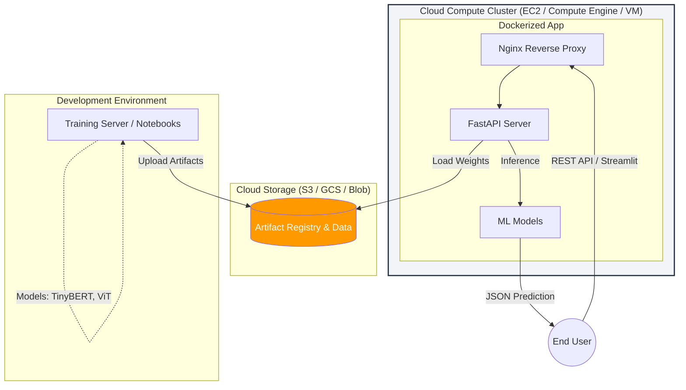

# Multi-Cloud MLOps & Model Deployment

## End-to-End ML Production Pipeline

This repository is a complete guide to **MLOps**, demonstrating how to take experimental Machine Learning models and deploy them as scalable, production-ready REST APIs using **FastAPI**, **Docker**, and **Multi-Cloud Infrastructure (AWS, GCP, Azure)**.

---

## 🏗 System Architecture

The following diagram illustrates the flow from data storage to the end-user:



---

## Tech Stack

* **Cloud Providers:** AWS, Google Cloud Platform (GCP), Microsoft Azure
* **Python Version:** 3.11.8
* **AWS SDKs:** `boto3` (S3, EC2, IAM, ECR, ECS)
* **GCP SDKs:** `google-cloud-storage`, `google-cloud-compute`, `google-cloud-artifact-registry`, `google-cloud-run`, `google-cloud-iam`
* **Azure SDKs:** `azure-identity`, `azure-storage-blob`, `azure-mgmt-storage`, `azure-mgmt-compute`, `azure-mgmt-network`, `azure-mgmt-authorization`, `azure-mgmt-containerregistry`
* **API Framework:** FastAPI, Streamlit
* **Containerization:** Docker, Docker Compose
* **Web Server:** Nginx (Reverse Proxy)
* **Models:** TinyBERT (NLP sentiment + disaster classification), Vision Transformer (pose classification)

---

## Project Structure

### `docs/`

Theoretical foundations and setup guidelines:
- `architecture/` — Research papers, MLOps concepts, deployment overviews
- `setup/` — SSH, VS Code Remote, IAM roles, Elastic IP configuration guides

### `infrastructure/aws/`

| Step | Folder | Description |
|------|--------|-------------|
| 1 | `01-s3-storage-setup/` | S3 bucket creation, dataset upload |
| 2 | `02-model-training/` | TinyBERT + ViT training notebooks, push to S3 |
| 3 | `03-ec2-compute-setup/` | EC2 instance provisioning via boto3 |
| 4 | `04-local-app-development/` | FastAPI app + Streamlit frontend (local) |
| 5 | `05-deploy-streamlit-ec2/` | Deploy Streamlit to EC2 |
| 6 | `06-dockerize-app-and-fastapi/` | FastAPI + Nginx Docker stack |
| 7 | `07-deploy-fastapi-ecs/` | Push to ECR, deploy to ECS Fargate |

### `infrastructure/gcp/`

Start with the master notebook: `gcp-mlops-complete.ipynb`

| Step | Folder | Description |
|------|--------|-------------|
| 1 | `01-gcs-storage-setup/` | GCS bucket creation, dataset upload |
| 2 | `02-model-training/` | TinyBERT + ViT training notebooks, push to GCS |
| 3 | `03-gce-compute-setup/` | GCE instance provisioning via Python SDK |
| 4 | `04-local-app-development/` | FastAPI app + Streamlit frontend (local) |
| 5 | `05-deploy-streamlit-gce/` | Deploy Streamlit to GCE |
| 6 | `06-dockerize-app-and-fastapi/` | FastAPI + Nginx Docker stack |
| 7 | `07-deploy-cloud-run/` | Push to Artifact Registry, deploy to Cloud Run |

### `infrastructure/azure/`

Start with the master notebook: `azure-mlops-complete.ipynb`

| Step | Folder | Description |
|------|--------|-------------|
| 1 | `01-azure-blob-storage-setup/` | Storage account + blob container setup |
| 2 | `02-model-training/` | TinyBERT + ViT training notebooks, push to Azure Blob |
| 3 | `03-azure-vm-setup/` | Azure VM + NSG provisioning via Python SDK |
| 4 | `04-local-app-development/` | FastAPI app + Streamlit frontend (local) |
| 5 | `05-deploy-streamlit-vm/` | Deploy Streamlit to Azure VM |
| 6 | `06-dockerize-app-and-fastapi/` | FastAPI + Nginx Docker stack |
| 7 | `07-deploy-azure-container-apps/` | Push to ACR, deploy to Container Apps |

### `datasets/`

Raw CSV and TSV datasets for model training (IMDB reviews, Twitter sentiment, disaster tweets).

---

## Getting Started

### Prerequisites

- Python 3.11.8
- Docker and Docker Compose
- Cloud CLI: `aws configure` / `gcloud auth login` / `az login`

### 1. Clone the Repository

```bash
git clone https://github.com/omixec/AWS-multi-models-MLOPS.git
cd AWS-multi-models-MLOPS
```

### 2. Create a Virtual Environment

```bash
python3.11 -m venv venv
source venv/bin/activate
```

### 3. Install Cloud-Scoped Dependencies

Install only the requirements for the cloud provider you are working with:

```bash
# AWS
pip install -r infrastructure/aws/requirements.txt

# GCP
pip install -r infrastructure/gcp/requirements.txt

# Azure
pip install -r infrastructure/azure/requirements.txt

# FastAPI app (local dev)
pip install -r infrastructure/aws/04-local-app-development/fastapi/requirements.txt
```

### 4. Configure Environment Variables

```bash
# GCP
cp infrastructure/gcp/.env.example infrastructure/gcp/.env
# Edit infrastructure/gcp/.env with your project values

# Azure
cp infrastructure/azure/01-azure-blob-storage-setup/.env.example infrastructure/azure/.env
# Edit with your subscription and storage account details
```

### 5. Start with the Master Notebook

```bash
# GCP full workflow
jupyter notebook infrastructure/gcp/gcp-mlops-complete.ipynb

# Azure full workflow
jupyter notebook infrastructure/azure/azure-mlops-complete.ipynb
```

### 6. Run the Docker Stack

```bash
# AWS (reference implementation)
cd infrastructure/aws/06-dockerize-app-and-fastapi
docker compose up --build
# API docs: http://localhost/docs
```

---

## IAM Security Patterns

All three clouds follow least-privilege: service identities get only the roles they need, scoped as narrowly as possible.

| Cloud | Identity Type | Scope Strategy |
|-------|---------------|----------------|
| AWS | IAM Role + Instance Profile | Inline policy with specific S3 bucket ARN; role attached to EC2/ECS task |
| GCP | Service Account | `set_iam_policy()` on GCS bucket + GAR repo (resource-scoped); `roles/run.developer` at project level (Cloud Run limitation) |
| Azure | Service Principal (App Registration) | `role_assignments.create()` scoped to storage account ARM path / resource group / ACR resource |

---

## 📚 Resources & Documentation

The repository contains detailed documentation in Markdown format in the `docs/` folder:

* `docs/architecture/MLOps_Architecture.md`: General overview of the MLOps lifecycle and system architecture.
* `docs/architecture/ML_Model_Deployment.md`: Guide on ML Model deployment types, challenges, and workflows.
* `docs/architecture/ViT_Vision_Transformer.md`: Understanding the Vision Transformer architecture behind Pose Classification.
* `docs/architecture/ML_Model_Serving_over_REST_API.md`: Details about model serving over REST APIs.
* `docs/architecture/Docker_Overview.md`: Deep dive into containerizing ML applications.
