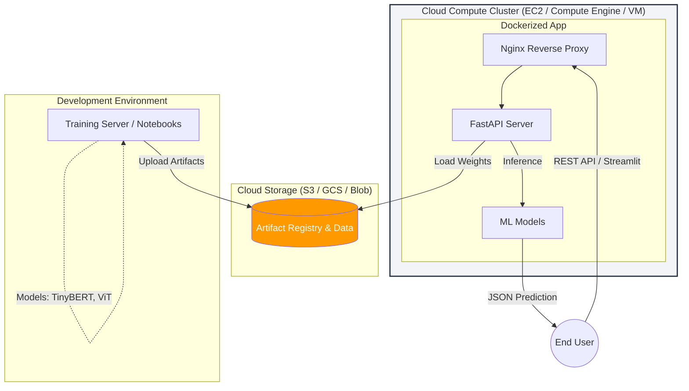

# Multi-Cloud MLOps & Model Deployment

## 🚀 End-to-End ML Production Pipeline

This repository is a complete guide to **MLOps**, demonstrating how to take experimental Machine Learning models and deploy them as scalable, production-ready REST APIs using **FastAPI**, **Docker**, and **Multi-Cloud Infrastructure (AWS, GCP, Azure)**.

---

## 🏗 System Architecture

The following diagram illustrates the flow from data storage to the end-user:



---

## 🛠 Tech Stack

* **Cloud Providers:** AWS, Google Cloud Platform (GCP), Microsoft Azure
* **Infrastructure SDKs:** Boto3 (AWS), google-cloud (GCP), azure-sdk (Azure)
* **API Framework:** FastAPI, Streamlit
* **Containerization:** Docker, Docker-Compose
* **Web Server:** Nginx (Reverse Proxy)
* **Models:** TinyBERT (NLP), Vision Transformer (CV)

---

## 📂 Project Structure

### 1. `docs/`
Contains theoretical foundations and setup guidelines:
*   **`architecture/`**: Research papers (e.g., Vision Transformer), deployment overviews, and MLOps concepts.
*   **`setup/`**: Step-by-step guides for environment configuration (SSH, VS Code Remote, Crontab auto-starts, IAM roles, and Elastic IP configuration).

### 2. `infrastructure/`
Cloud-specific automation scripts and infrastructure as code to deploy the stack:
* **`aws/`**: Reorganized into a numbered, step-by-step MLOps workflow:
  * `01-s3-storage-setup/`: S3 buckets management.
  * `02-model-training/`: Jupyter notebooks for ML models (moved from root).
  * `03-ec2-compute-setup/`: EC2 provisioning.
  * `04-local-app-development/`: FastAPI and Streamlit local apps.
  * `05-deploy-streamlit-ec2/`: Streamlit on EC2 deployment.
  * `06-dockerize-fastapi/`: Dockerized FastAPI stack.
  * `07-deploy-fastapi-ecs/`: AWS ECR and ECS deployment.
* **`gcp/`**: Compute Engine, Cloud Storage, Artifact Registry, and Cloud Run scripts.
* **`azure/`**: Virtual Machines, Blob Storage, ACR, and ACI scripts.

### 3. `datasets/`
Contains the raw CSV and TSV datasets required for the model training phase (e.g., IMDB reviews, Twitter sentiment data, disaster tweets).

---

## 🚀 Getting Started

### Prerequisites

* Python 3.9+
* Docker & Docker-Compose installed
* Appropriate Cloud CLI configured (`aws configure`, `gcloud auth login`, or `az login`)

### Installation & Local Setup

1. **Clone the Repository:**
```bash
git clone https://github.com/omixec/AWS-multi-models-MLOPS.git
cd AWS-multi-models-MLOPS
```

2. **Environment Setup:**
Create a virtual environment and install dependencies based on the module or cloud provider you are working with:
```bash
python -m venv venv
source venv/bin/activate

# For AWS infrastructure
pip install -r infrastructure/aws/requirements.txt

# For GCP infrastructure
pip install -r infrastructure/gcp/requirements.txt

# For Azure infrastructure
pip install -r infrastructure/azure/requirements.txt

# For application modules, navigate to their directories
cd infrastructure/aws/04-local-app-development/fastapi
pip install -r requirements.txt
```

3. **Run the Production Stack (Docker):**
To launch the FastAPI app with Nginx locally:
```bash
cd infrastructure/aws/06-dockerize-fastapi
docker-compose up --build
```
* **API Docs:** Visit `http://localhost/docs` (served via Nginx)

---

## 📚 Resources & Documentation

The repository contains detailed documentation in Markdown format in the `docs/` folder:

* `docs/architecture/MLOps_Architecture.md`: General overview of the MLOps lifecycle and system architecture.
* `docs/architecture/ML_Model_Deployment.md`: Guide on ML Model deployment types, challenges, and workflows.
* `docs/architecture/ViT_Vision_Transformer.md`: Understanding the Vision Transformer architecture behind Pose Classification.
* `docs/architecture/ML_Model_Serving_over_REST_API.md`: Details about model serving over REST APIs.
* `docs/architecture/Docker_Overview.md`: Deep dive into containerizing ML applications.
