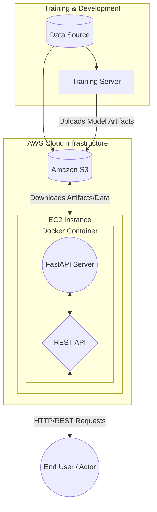

# MLOps Architecture

This document outlines the high-level architecture of the Machine Learning Operations (MLOps) pipeline used in this project.

## System Architecture Diagram

## Architecture Explanation

1. **Training Server & Data:** This is where the initial data processing and model training occur. The data can either be fed directly into the training server or stored in the cloud.
2. **Amazon S3 (Simple Storage Service):** Acts as the central artifact repository. Once a model is trained (e.g., a `.pt` or `.bin` file), it is uploaded to an S3 bucket. Data assets (like sample images) can also be stored here.
3. **AWS EC2 (Elastic Compute Cloud):** A cloud virtual machine that hosts the production environment.
4. **Docker Container:** Inside the EC2 instance, the application is containerized using Docker to ensure consistency across environments.
5. **FastAPI:** A modern, fast web framework used to build the RESTful API within the Docker container. It loads the model weights from S3 and serves predictions.
6. **Actor (User):** The end-user or client application that sends requests to the FastAPI endpoint and receives predictions in response.
